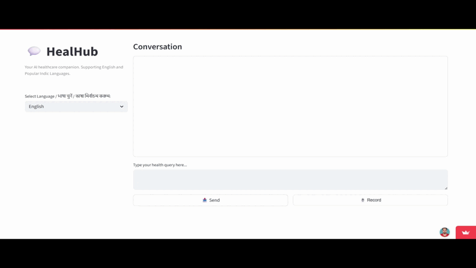

# 🩺 HealHub – Streamlit Cloud Deployment

This repository contains the **Streamlit Cloud deployment** of **HealHub**, a voice-enabled healthcare assistant built as part of the **DA2250 (Summer 2025)** project at **IISc Bangalore**.

HealHub helps users interact through voice or text to receive basic healthcare guidance in a conversational format.

## 🚀 Live Demo

You can try the live demo here:  
👉 [Launch HealHub on Streamlit](https://healhuub.streamlit.app/)

## 📦 About This Repository

Since Streamlit Cloud requires repository ownership for deployment, this version was created separately for hosting purposes.

The full development and collaboration happened in the [original team repository](https://github.com/rootbid/HealHub).

 

# Demo

